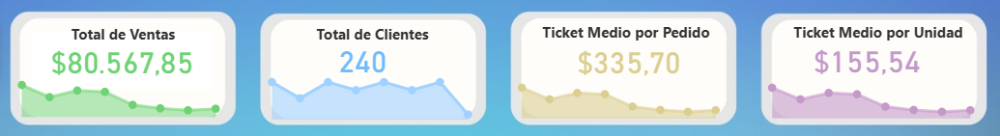
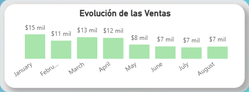
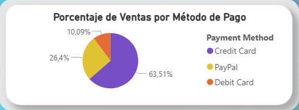

# 🛒 Análisis de Ventas Online

## Descripción general

Este proyecto tiene como objetivo realizar un **análisis exploratorio** de un conjunto de datos de **transacciones de ventas online**, con el fin de descubrir **patrones relevantes** y extraer **insights** que puedan mejorar la **toma de decisiones**. Este análisis está orientado a **perfiles de negocio**, proporcionando **conclusiones claras** respaldadas por **visualizaciones** y **métricas clave**, que facilitan la **interpretación y comprensión de los resultados**.

--------

## Objetivos del análisis

A lo largo del análisis se abordarán los siguientes objetivos:

- 📈 **Analizar las ventas a lo largo del tiempo** para detectar patrones estacionales o tendencias.
- 💳 **Evaluar cómo influyen los métodos de pago** en los ingresos o el volumen de ventas.
- 🌍 **Investigar la popularidad de las categorías de productos** en distintas regiones geográficas.
- 📌 **Examinar el rendimiento de productos y categorías** según la región.
- 🏆 **Identificar los productos más vendidos** dentro de cada categoría.

--------

## Dataset

El dataset, disponible en Kaggle en formato CSV, contiene **240 registros**, cada uno correspondiente a una transacción individual realizada en una tienda online. Las variables incluidas son las siguientes:

#### **Columnas**:

- **Transaction ID**: Identificador único de cada transacción.  
- **Date**: Fecha en la que se realizó la transacción.  
- **Product Category**: Categoría general del producto vendido.  
- **Product Name**: Nombre específico del producto.  
- **Units Sold**: Número de unidades vendidas en la transacción.  
- **Unit Price**: Precio por unidad del producto.  
- **Total Revenue**: Ingresos totales generados por la transacción (*Units Sold × Unit Price*).  
- **Region**: Región geográfica en la que se realizó la venta.
- **Payment Method**: Método de pago utilizado.

--------

## Herramientas utilizadas

- **Jupyter Notebook**: Documentación del proceso de análisis. 
- **Python (pandas, matplotlib, seaborn)**: Limpieza y análisis exploratorio de datos.  
- **SQL (SQLite)**: Consultas para segmentación de clientes, regiones y productos.  
- **Power BI**: Creación de dashboards interactivos para la visualización de resultados. 

--------

## Resultados destacados

### Ventas y Clientes 💰

> Se alcanzaron $80.567,85 en ventas con 240 clientes únicos. El ticket medio por pedido fue de $335,70 , mientras que por unidad vendida fue de $155,54.

### Evolución Temporal 📈

> Las ventas muestran una tendencia decreciente, con picos en enero y, en menor medida, en marzo y abril.

### Métodos de Pago 💳

> El método que generó más ingresos fue la tarjeta de crédito (63,51%), seguido de PayPal (26,4%) y la tarjeta de débito (10,09%).

### Categorías y Productos 🏆

> Los productos con mayores ventas se encuentran principalmente en las categorías **Electronics** y **Home Appliances**.  
> - En **Electronics**, destacan Canon EOS R5 Camera, MacBook Pro 16-inch y Apple McBook Pro 16-inch.  
> - En **Home Appliances**, destaca LG OLED TV.

--------

## 📂 Estructura del proyecto

```
Online-Sales-Analysis
├── 📁 data
│   ├── online_sales.csv           # Dataset original
│   └── online_sales_cleaned.csv    # Dataset limpio y procesado
│
├── 📁 notebooks
│   ├── 01_limpieza_datos.ipynb          # Limpieza y preprocesamiento de datos
│   ├── 02_analisis_ventas.ipynb          # Análisis de ventas a lo largo del tiempo
│   └── 03_analisis_metodos_pago.ipynb     # Análisis de métodos de pago
│
├── 📁 query
│   ├── 04_analisis_productos.sql    # Consultas SQL por categoría y producto
│   └── online_sales.db               # Base de datos SQLite con los datos
│
├── 📁 reports
│   ├── 📊 online_sales_dashboard.pbix    # Dashboard interactivo en Power BI
│   └── informe_analisis_ventas.pdf    # Informe técnico
|
├── 📁 images
|   ├── kpis.png
|   ├── ventas_mensuales.png
|   ├── metodos_pago.png
|   ├── top_categorias.png
|   └── top_cateogorias_productos.png
│
└── README.md 
```

--------

## Contacto

**Borja Macías Torreblanca**  
✉️ bmactor2001@gmail.com  
[LinkedIn](https://www.linkedin.com/in/borjamacias) | [GitHub](https://github.com/bxrjamt)

 


